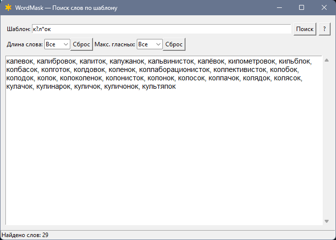

# WordMask

`WordMask` — это приложение для поиска слов по шаблону. Оно позволяет находить слова из текстового файла, соответствующие заданному шаблону, с возможностью фильтрации по длине слова и количеству гласных. 

Приложение полезно для поэтов, писателей и всех, кто работает с текстами.

## Возможности
Поиск слов по шаблону с использованием символов * (любая последовательность символов) и ? (один символ).

- Фильтрация результатов по длине слова и количеству гласных.
- Простой и интуитивно понятный интерфейс.
- Поддержка больших текстовых файлов (словарей).

## Загрузка
Скачайте архив с проектом или клонируйте репозиторий с помощью команды:

```
git clone https://github.com/mnbarinov/word-mask.git
```

## Создание базы данных
Для работы приложения необходимо создать базу данных SQLite из текстового файла со словами.

Подготовьте текстовый файл (russian.txt), где каждое слово находится на новой строке.

### Установите необходимые зависимости (если требуется):

```
pip install chardet
```

### Запустите скрипт sqlite.py:

```
python sqlite.py
```
Скрипт создаст файл words.db — это база данных, которая будет использоваться приложением.

## Запуск программы
Убедитесь, что у вас установлен Python 3.

Запустите программу:

```
python wordmask.py
```

### Использование скомпилированной версии
Для пользователей, которые не хотят или не могут скомпилировать программу самостоятельно, доступна скомпилированная версия wordmask.exe.

- Скачайте wordmask.exe из репозитория.
- Запустите файл wordmask.exe.

Убедитесь, что база данных words.db находится в той же папке, что и wordmask.exe. 

## Компиляция программы
Если вы хотите скомпилировать программу самостоятельно:

Установите pyinstaller:

```
pip install pyinstaller
```

Перейдите в папку с проектом и выполните команду:

```
pyinstaller --onefile --windowed wordmask.py
```

Скомпилированный файл будет находиться в папке dist.

## Инструкция по использованию
### Интерфейс программы



 - Поле "Шаблон":

    Введите шаблон для поиска слов.
    Используйте * для замены любой последовательности символов и ? для замены одного символа.
    ```
    Пример: шаблон море* найдет все слова, начинающиеся на "море".
    ```
    
- Фильтры:

    Длина слова: Ограничивает поиск словами определенной длины.
  
    Макс. гласных: Ограничивает поиск словами с определенным количеством гласных.

- Кнопка "Поиск":

    Запускает поиск слов по заданному шаблону и фильтрам.

- Кнопка "?":

    Открывает справку по использованию программы.

- Поле вывода результатов:

    Отображает найденные слова. Вы можете копировать текст, используя контекстное меню (правая кнопка мыши).

### Примеры использования
- Поиск слов по шаблону:
```
Введите шаблон ко* и нажмите "Поиск". Программа найдет все слова, начинающиеся на "ко".
```
- Фильтрация по длине:
```
Введите шаблон ?ок, выберите длину слова 3 и нажмите "Поиск".".
```
 Программа найдет все трехбуквенные слова, оканчивающиеся на "ок
- Фильтрация по количеству гласных:
```
Введите шаблон *, выберите максимальное количество гласных 2 и нажмите "Поиск". 
```
Программа найдет все слова с двумя или менее гласными.

## Лицензия
Этот проект распространяется под лицензией MIT. Подробности см. в файле LICENSE.

## Поддержка
Если у вас возникли вопросы или предложения, создайте issue в репозитории или свяжитесь со мной: [mnbarinov](https://github.com/mnbarinov).
